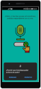

<html>

<head>

  <meta http-equiv="content-type" content="text/html; charset=utf-8" />
  <meta charset="utf-8">
  <meta name="viewport" content="width=device-width, initial-scale=1, maximum-scale=1">

  <meta name="keywords" content="" />
  <meta name="description" content="" />

  <!-- css -->
  <link rel="stylesheet" href="webdesign/css/bootstrap.css" />
  <link rel="stylesheet" href="webdesign/css/bootstrap-responsive.css" />
  <link rel="stylesheet" href="webdesign/css/prettyPhoto.css" />
  <link rel="stylesheet" href="webdesign/css/sequence.css" />
  <link rel="stylesheet" href="webdesign/css/style.css" />

  <!-- =======================================================
    Theme Name: Bootslander
    Theme URL: https://bootstrapmade.com/bootslander-free-bootstrap-landing-page-template/
    Author: BootstrapMade.com
    Author URL: https://bootstrapmade.com
	======================================================= -->
</head>

<body>

  

    <header>
      

        

          

            <a href="index.html">
              <!-- your logo image -->
              
            </a>
          

          
        

      

      <!-- end top area -->
    </header>
    <!-- end of header-->

    <!-- section intro -->
    <section id="intro">
      

        

          

            <!-- slider -->
            

              

                

                  
                  
                  <ul>
                    <li class="animate-in">
                      <h2 class="title">Petición permiso micrófono</h2>
                      <h5 class="subtitle">Se utiliza para hablar (mediante audio) con la aplicación.</h5>
                      
                    </li>
                    <li>
                      <h2 class="title">Pantalla principal</h2>
                      <h5 class="subtitle">Muestra una lista de comandos para interactuar con la I.A.</h5>
                      
                    </li>
                  </ul>
                

                <ul class="nav">
                  <li></li>
                  <li></li>
                </ul>
              

            

            <!-- end slider -->
          

        

      

    </section>
    <!-- end section intro -->

    <!-- section main content -->
    <section id="main-content">
      

        <!-- wrapper -->
        

          <!-- boxes -->
          

            

              <!-- box 1 -->
              

                

                  <h4>¡ATENCIÓN!</h4>
                  
 Siempre buscar un profesional de la salud mental. 

                

              

              <!-- box 2 -->
              

                

                  <h4>¡ATENCIÓN!</h4>
                  
 Ten en cuenta que esta no es una aplicación milagrosa, y que el seguimiento de los ejercicios de respiración es lo que ayudará en gran medida a sobrellevar la situación. 

                

              

              <!-- box 3 -->
              

                

                  <h4> ¡ATENCIÓN!</h4>
                  
 El sistema NO es desarrollado de la mano ni guía de un especialista de la salud mental. 

                

              

            

			  
			
Por lo anterior descrito esta aplicación se debe de tomar como una herramienta para personas que solo necesitan un recordatorio de la realización de los ejercicios de respiración y meditación expuestos por el asistente, además de que al no ser un humano, no posee las herramientas naturales para saber si se necesita de una ayuda externa más especializada en un ataque cuyo grado de ansiedad aumente de manera desenfrenada.

          

          <!-- end boxes -->

          <!-- testimonials -->
          

			  
			<h3>Descripción</h3>
		  
            

				La aplicación Ansiedapp busca ayudar en esos momentos donde la persona se encuentra sufriendo un ataque de ansiedad y no tiene un apoyo humano cerca. De igual manera si se usará fuera de un ataque de ansiedad, ayudaría a saber que tipo de ejercicios realizar y de que manera hacerlo, esto para irse acostumbrando a los ejercicios propuestos
			

			  
			<h3>Internet</h3>
			

				La aplicación debe contar con acceso a internet para poder funcionar.
				A pesar de parecer una limitación la aplicación tendrá la posibilidad de trabajar sin acceso, en lo que se considerará "Modo manual", esto pues sin el acceso a internet no es posible usar la Inteligencia Artificial asociada a la aplicación.
			

			  
			<h3>Limitaciones del proyecto a tener en cuenta:</h3>
			

				No se realizarán actualizaciones del programa según los nuevos estudios y resultados de investigación sobre ataques de ansiedad. No se tendrá en cuenta la edad de la persona que utilice la aplicación, pues esto supone métodos diferentes de enfrentar un ataque de ansiedad.
			

			  
			<h3>Versión minima y uso en Tablets</h3>
			

				La versión minima soportada por la aplicación es la 4.3
			

			
			
				La aplicación si corre en tablet pero aún se deben configurar los tamaños y disposiciones para estas resoluciones, por lo que es posible que no tenga un diseño agradable a la vista.
			

			  
			<h3>Derechos de uso de imagenes y diseños:</h3>
			

				Icono diseñado por  <a href="https://www.freepik.es/starline" target="blank">Starline</a>
			

			

				https://www.freepik.es/vector-gratis/feliz-janmashtami-pluma-pavo-real-hermoso-fondo_5251563.htm#page=1&query=pavo%20real&position=20
			

          

        

        <!-- end wrapper -->

      

    </section>
    <!-- end main content section -->

    <!-- section bottom -->
    <section id="bottom">
      

        

            <!--### Subtitle ###-->
            <h2>Descargar el archivo APK de la aplicación</h2>
            <!-- CTA -->
            

              

                <a href="https://1drv.ms/u/s!AhHnvYvtKgyQi0skPkigAbJCZT2e?e=Dhkm8x" class="btn btn-green btn-large" target="_blank"> Descargar</a>
                
              

            

          

      

    </section>
    <!-- end section bottom -->

    <!-- footer -->
    <footer>
      

        

          

          

            
            
&#169; Copyright. All rights reserved

          

          

            <!--
              All the links in the footer should remain intact.
              You can delete the links only if you purchased the pro version.
              Licensing information: https://bootstrapmade.com/license/
              Purchase the pro version with working PHP/AJAX contact form: https://bootstrapmade.com/buy/?theme=Bootslander
            -->
            Designed by <a href="https://bootstrapmade.com/">BootstrapMade</a>
          

        

      

    </footer>

  

  <!-- end main wrap -->

  <!-- Javascript Libraries -->
  
  
  
  
  

  <!-- Template Custom Javascript File -->
  

</body>

</html>
